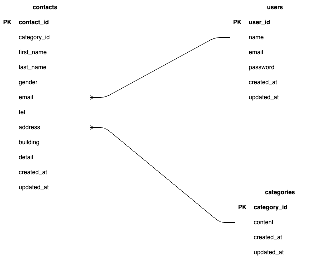

# Test-contact-form

##環境構築

Dockerビルド
    1.git clone git@github.com:Haruki1799/Test-contact-form.git
    2.docker-compose up -d --build

Laravel環境構築
    1.docker-compose exec php bash
    2.composer -v
    3.composer create-project "laravel/laravel=8.*" . --prefer-dist
    4.composer install
    5./config/app.phpのtimezoneを変更
    6.env.exampleファイルから.envを作成し、環境変数を変更
    7.php artisan make:migration create_categories_table
    8.php artisan make:migration create_contacts_table
    9.2014_10_12_000000_create_users_table.phpを変更
    10.php artisan migrate
    11.php artisan key:generate
    12.php artisan make:seeder CategoriesTableSeeder
    13.php artisan make:seeder ContactTableSeeder
    14.php artisan db:seed

##使用技術（実行環境）
・php 7.4.9
・Lavavel 8.83.29
・MySQL 8.0.26

##ER図

##URL
・開発環境:http://localhost/
・phpMyAdmin:http://localhost:8080/